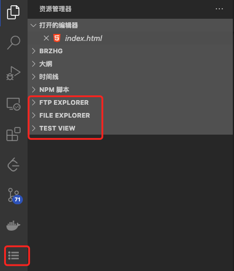

## package.json

```json
{
  "name": "helloWorld-sample",
  "displayName": "helloWorld-sample",
  "description": "HelloWorld example for VS Code",
  "version": "0.0.1",
  "publisher": "vscode-samples",
  "repository": "https://github.com/microsoft/vscode-extension-samples/helloworld-sample",
  "engines": {
    "vscode": "^1.51.0"
  },
  "categories": ["Other"],
  "activationEvents": ["onCommand:extension.helloWorld"],
  "main": "./out/extension.js",
  "contributes": {
    "commands": [
      {
        "command": "extension.helloWorld",
        "title": "Hello World"
      }
    ]
  },
  "scripts": {
    "vscode:prepublish": "npm run compile",
    "compile": "tsc -p ./",
    "watch": "tsc -watch -p ./"
  },
  "devDependencies": {
    "@types/node": "^8.10.25",
    "@types/vscode": "^1.51.0",
    "tslint": "^5.16.0",
    "typescript": "^3.4.5"
  }
}
```

* main: 入口文件
* [publisher].[name]: 扩展唯一标识
* activationEvents: 激活事件
* contributes: 贡献点
完整字段参考：<https://code.visualstudio.com/api/references/extension-manifest>

### 激活事件（activationEvents）

* onLanguage，每当打开解析为某种语言的文件时
* onCommand，每当调用命令时
* onDebug，在启动调试会话之前
  * onDebugInitialConfigurations
  * onDebugResolve
* workspaceContains
* onFileSystem
* onView，每当在VS Code侧栏中展开指定ID的视图时
* onUri
* onWebviewPanel
* onCustomEditor
* \*
* onStartupFinished

### 贡献点(Contribution Points)

<https://code.visualstudio.com/api/references/contribution-points>
configuration：用户将能够将这些配置选项设置为“用户设置”或“工作区设置”。
> 通过vscode.workspace.getConfiguration('myExtension')读取

```json
{
  "contributes": {
    "configuration": {
      "title": "TypeScript",  // 唯一，需简洁，标识扩展的确切名称
      "properties": {
        "typescript.useCodeSnippetsOnMethodSuggest": {
          "type": "boolean",
          "default": false,
          "description": "Complete functions with their parameter signature."
        },
        "typescript.tsdk": {
          "type": ["string", "null"],
          "default": null,
          "description": "Specifies the folder path containing the tsserver and lib*.d.ts files to use."
        }
      }
    }
  }
}
```

configurationDefaults
commands
menus
keybindings
languages
debuggers
breakpoints
grammars
themes
iconThemes
productIconThemes
snippets
jsonValidation
views
viewsWelcome
viewsContainers
problemMatchers
problemPatterns
taskDefinitions
colors
typescriptServerPlugins
resourceLabelFormatters
customEditors

#### 添加新的侧边栏

```json
"contributes": {
  "viewsContainers": {
   "activitybar": [   
    // 添加一个新的侧边栏
    {
     "id": "package-explorer",
     "title": "Package Explorer",
     "icon": "media/dep.svg"
    }
   ]
  },
  "views": {
   "package-explorer": [
    {
     "id": "nodeDependencies",
     "name": "Node Dependencies",
     "icon": "media/dep.svg",
     "contextualTitle": "Package Explorer"
    }
   ],
   // 侧栏中的资源管理器视图
   "explorer": [
    {
     "id": "jsonOutline",
     "name": "Json Outline",
     "when": "jsonOutlineEnabled"
    },
    {
     "id": "ftpExplorer",
     "name": "FTP Explorer"
    },
    {
     "id": "fileExplorer",
     "name": "File Explorer"
    },
    {
     "id": "testView",
     "name": "Test View"
    }
   ]
  }
}
```



## webview API

<https://code.visualstudio.com/api/extension-guides/webview>
> 允许扩展在Visual Studio Code中创建完全可自定义的视图。例如，内置的Markdown扩展使用Web视图来呈现Markdown预览
